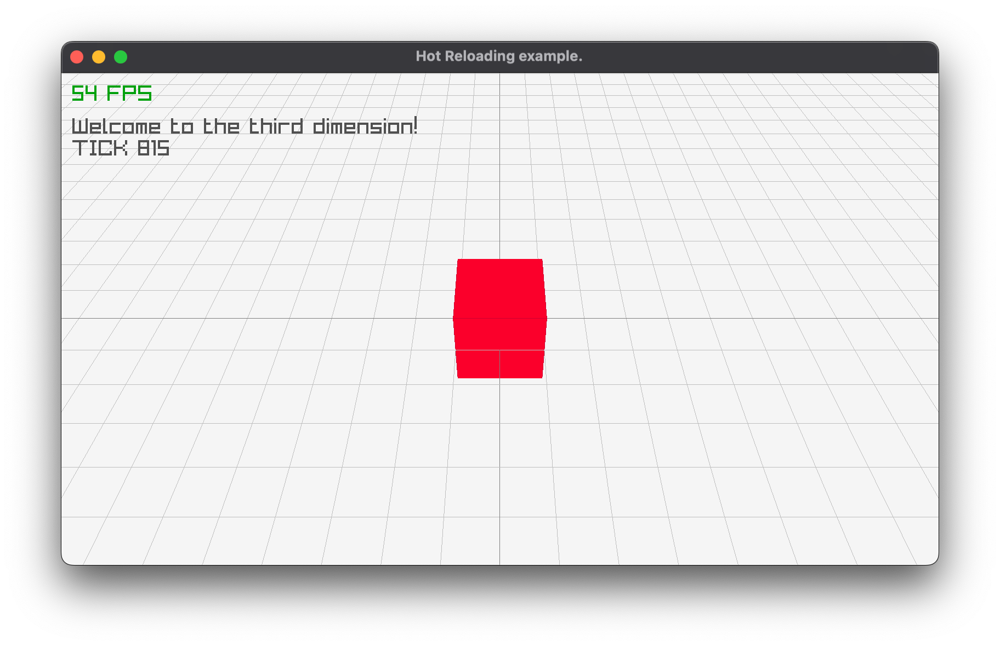

# Hot Code Reloading in C

This is some example code which demos hot-code reloading
using `dlopen(3)` and `dlsym(3)` of game code while the game
is running.

The code should work in theory on any UNIX platform.  It's
tested on Mac OS.

The "game" part is not really there -- this is just a demo
on hot-reloading at the moment.

The graphics part is done using [Raylib](https://www.raylib.com).



[](https://github.com/seletz/raylib-hot-code-reload-c-example/actions/workflows/cmake-single-platform.yml)

## Why?

When doing graphics programming for games or "recreational"
programming, one wants to have a fast feedback loop.

Additionally, when testing / debugging a game, we often need
to reload the **logic** of the game and test it with a given
game state.  Often enough we can't fully serialise and reload
game state from/to disk.


## How It Works

The "game" is split into two parts.  A main executable and a
shared library which holds the game code.

At startup, the main executable looks for a `game.so` and tries
to load it.

In the game loop, when `r` is pressed, the `game.so` shared library
is reload.

Loading and reloading is done using `dlopen(3)`.  We look for
symbols in the shared object using `dlsym(3)` and reset the function
pointers to the new symbols.

Function pointers are defined for all the functions we need/want to
reload.

## Game logic

Game state is allocated on the heap using `init_gamestate()`.

In the game loop, we call `update_gamestate()` for each frame.  This
function is supposed to update the global game state.  Rendering is
done by calling `update_frame()`.

At the beginning of each frame the code checks if the `r` key is
pressed.  If so, the `do_reload()` function is called, which in turn
calls `reload()` with the correct parameters to reload `game.so`.

## links

I got inspired to try this by this [blog post](https://medium.com/@TheElkantor/how-to-add-hot-reload-to-your-raylib-proj-in-c-698caa33eb74), which does something similar but for Windows.

I also found [this video](https://youtu.be/Y57ruDOwH1g) by [tsoding](https://www.youtube.com/tsoding) helpful.

## building and running

This project uses `cmake`.  `cmake` will fetch version `5.0` of
[raylib](https://www.raylib.com) and build it:

``` bash
$ brew install cmake
$ mkdir build
$ cd build
$ cmake ..
$ cmake -build .
```

This should generate the `mygame` main executable and the `libgamecode.so` shared library in the `build` directory.

To run the demo:

``` bash
$ ./mygame
```

## Hot Reloading

To test hot reloading, edit `src/game.c` while the game
is running -- e.g change the cube color.

Then rebuild:

``` bash
$ cd build
$ make
```

Now hit `r` with the game window active.  The color of the cube
should change.
